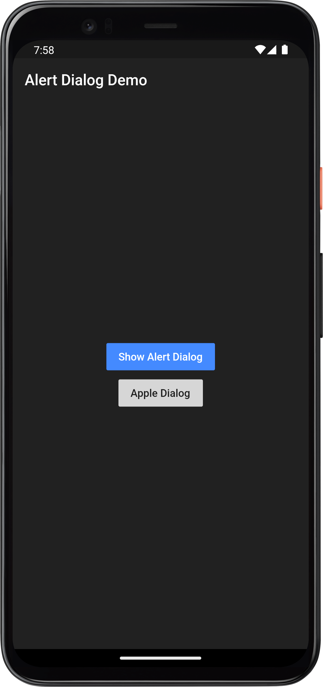
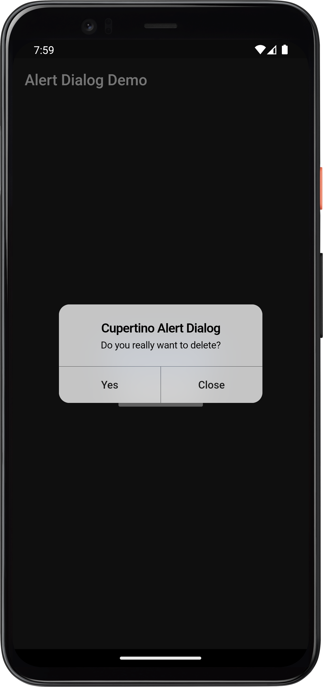

# Alert Dialog
Simple alert dialog with two options.


## Screenshots
### Home Page



### Cupertino(IOS) alert dialog demp


### Android alert dialog demo


## Run Locally

Clone the project

```bash
  flutter pub get
  flutter run
```

## Inspired from 

- [Official Documentation](https://pub.dev/packages/circular_countdown_timer)

## Links

* [Website](https://jayesh-shinde.web.app/)

